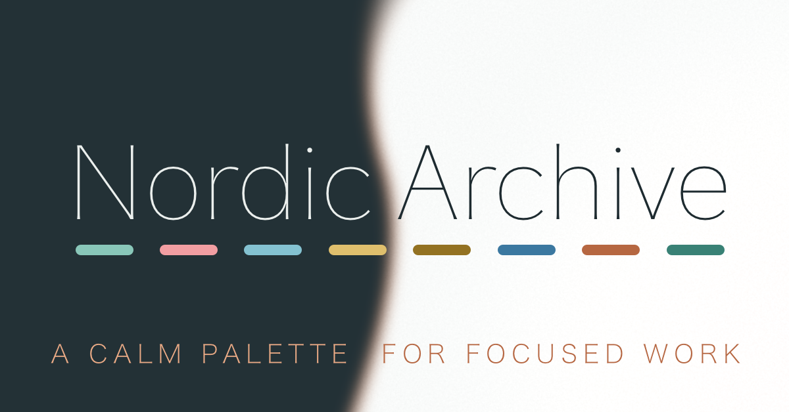

  

<h1 align="center">Nordic Archive</h1>

  <strong>A calm palette for focused work.</strong>

  A light and dark colour palette created while building Heurigraph ... with roots in Nord and a little more contrast, warmth, and punch.

  

    Core palette locked · Get the macOS <code>.clr</code> palette

    <a href="assets/Nordic%20Archive.clr?raw=1">here</a>

  

</p

---

## About
**Nordic Archive** has been designed to keep the part of the [Nord](https://www.nordtheme.com/docs/colors-and-palettes/) color palette that I have always liked, but gives the colours a little more presence. Nordic Archive shares clear roots with Nord, but the colours have moved enough to give the palette its own character.

The backgrounds remain quiet, while the status colours have more punch when they appear. The light and dark palettes belong together, but they are not simple inversions of one another. 

I am not a colour designer, and this is not an attempt to replace or improve Nord. It is simply the palette I wanted for Heurigraph.

### Created for Heurigraph

Nordic Archive was created while building **Heurigraph** … my ongoing project
for connecting, validating, and publishing mathematical knowledge.

Heurigraph is still developing, but its documents, diagrams, generated pages,
and visual identity needed a palette that could grow alongside it.

Nordic Archive is being released separately as a small, independent project.

---

## A note on the names

Names such as **Cobalt**, **Pine**, **Definition**, and **Strategy Copper** came
from how the colours first appeared inside Heurigraph and will most likely naturally evolve into new names. 

---

## Palette

### Dark mode

| Role | Hex | Preview |
|---|---:|:---:|
| Background | `#172024` |  |
| Secondary background | `#10171A` |  |
| Surface | `#253137` |  |
| Primary text | `#E6EBE8` |  |
| Secondary text | `#C6CFCC` |  |
| Muted text | `#A3AFAC` |  |
| Separator | `#354349` |  |
| Primary cobalt | `#7FAED3` |  |
| Link | `#9BC4E5` |  |
| Secondary pine | `#78BDAA` |  |
| Definition | `#73B6C6` |  |
| Focus wash | `#38515A` |  |
| Error | `#ED8A91` |  |
| Strategy copper | `#E49A73` |  |
| Warning amber | `#D7B35A` |  |
| Success | `#93C58A` |  |

### Light mode

| Role | Hex | Preview |
|---|---:|:---:|
| Background | `#F4F6F5` |  |
| Secondary background | `#E9EEEC` |  |
| Surface | `#DCE4E1` |  |
| Primary text | `#202A2E` |  |
| Secondary text | `#3D4B50` |  |
| Muted text | `#526267` |  |
| Separator | `#C8D2CF` |  |
| Primary cobalt | `#315F8C` |  |
| Link | `#2F648F` |  |
| Secondary pine | `#2E6F62` |  |
| Definition | `#277081` |  |
| Focus wash | `#B8C8CC` |  |
| Error | `#A13E45` |  |
| Strategy copper | `#A65332` |  |
| Warning amber | `#80601A` |  |
| Success | `#49723F` |  |

---

## macOS colour palette

The macOS `.clr` palette contains the complete Nordic Archive light and dark
colour sets.

[Download Nordic Archive.clr](assets/Nordic%20Archive.clr?raw=1)
---

## Accessibility

Nordic Archive does not claim universal accessibility compliance.

Contrast depends on how the colours are combined, along with the font size, weight, background, and context in which they are used. Check the combinations that matter for your own project.

---

## Acknowledgements

Nordic Archive is independently developed, but it would not exist without the
influence of [Nord](https://www.nordtheme.com/) and the years I spent using it as my default palette.

---

## Licence

Nordic Archive is available under the [MIT Licence](LICENSE).
